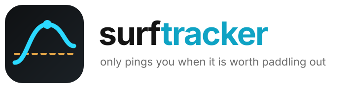

<p align="center">
  <picture>
    <source media="(prefers-color-scheme: dark)" srcset="assets/logo-dark.svg">
    
  </picture>
</p>

<p align="center">
  
  
  
  <a href="LICENSE"></a>
</p>

<p align="center">
  <a href="#quick-start">Quick Start</a> ·
  <a href="#what-counts-as-worth-it">The threshold</a> ·
  <a href="#pointing-it-at-another-spot">Another spot</a> ·
  <a href="#running-it-locally">Run locally</a>
</p>

**Checks the morning surf and texts you only when it is actually worth paddling out.**

Every weekday morning it reads the swell at New Smyrna Beach, rates it, and sends a Telegram
message *only if the session clears the bar*. On a flat morning it says nothing at all — which is
the whole design. An alert that fires every day gets ignored by the second week.

It runs itself on GitHub Actions, so there is no server and nothing to keep alive. Wave height,
period, and direction come from the [Open-Meteo Marine API](https://open-meteo.com/), which is
free and unauthenticated, so **there is no API key to get**.

## Quick start

1. Fork this repo.
2. Add two repository secrets under **Settings → Secrets and variables → Actions**:

| Secret | Where to get it |
| --- | --- |
| `TELEGRAM_BOT_TOKEN` | [@BotFather](https://t.me/BotFather) |
| `TELEGRAM_CHAT_ID` | Message your bot, then open `https://api.telegram.org/bot<TOKEN>/getUpdates` |

That's it. The workflow is already scheduled.

## What counts as worth it

A message is sent only when **both** are true:

| Gate | Threshold |
| --- | --- |
| Wave height | above **2.0 ft** |
| Rated condition | **Fair**, **Good**, or **Epic** |

Anything below that stays silent. Both numbers are constants at the top of `surf_check.py`.

## Pointing it at another spot

Change `LAT`, `LON`, and `SPOT_NAME` at the top of `surf_check.py`. The thresholds are the two
constants directly below them. Open-Meteo covers the whole coastline, so any break with a lat/lon
works.

## Running it locally

```bash
pip install -r requirements.txt
TELEGRAM_BOT_TOKEN=... TELEGRAM_CHAT_ID=... python surf_check.py
```

It prints the rating either way, so you can see what it decided even on a morning it would have
stayed quiet.

## License

MIT — see [LICENSE](LICENSE).
